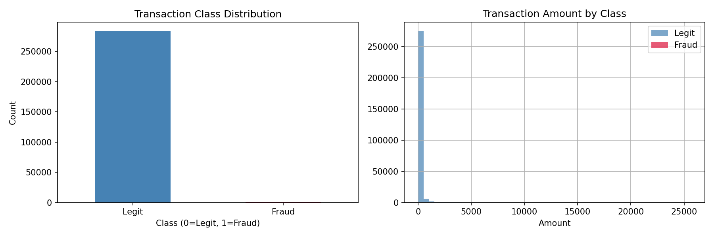
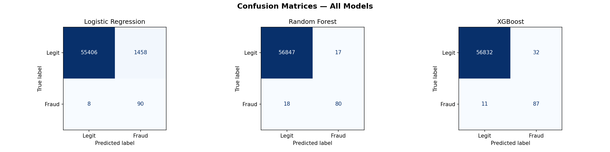
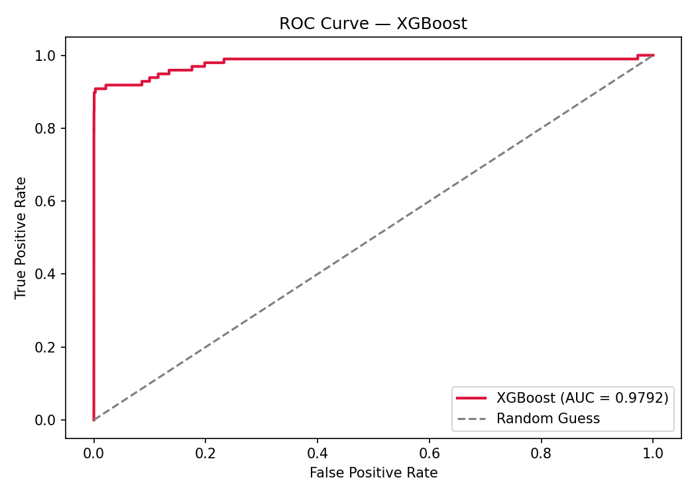
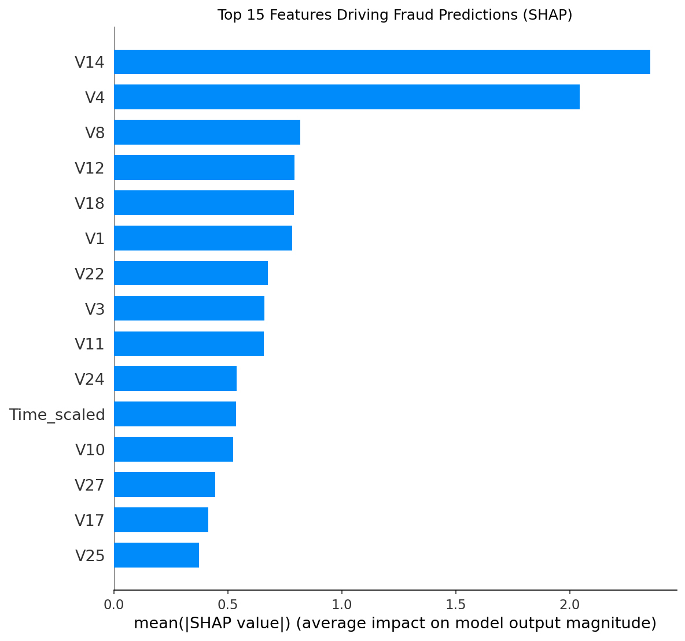

# Credit Card Fraud Detection

Built this as part of my ML learning journey. The dataset has 284,807 transactions and the interesting challenge here is that only 0.17% of them are actually fraud — so the class imbalance problem is real.

## What I worked on

The obvious problem with imbalanced data is that a model can just predict "legit" every time and get 99.8% accuracy. That's useless in practice. So the goal was to actually catch fraud, not just get a high accuracy number.

Steps I followed:
- EDA to visualize how imbalanced the data actually is
- Scaled `Amount` and `Time` (the V1-V28 features are already PCA transformed)
- Applied SMOTE on training data only to balance the classes
- Trained Logistic Regression, Random Forest, and XGBoost
- Compared models using Precision, Recall, F1, and ROC-AUC
- Added SHAP to understand which features actually matter

## Results

| Model | Precision | Recall | F1 Score | ROC-AUC |
|-------|-----------|--------|----------|---------|
| Logistic Regression | 0.0581 | 0.9184 | 0.1094 | 0.9698 |
| Random Forest | 0.8247 | 0.8163 | 0.8205 | 0.9688 |
| XGBoost | 0.7311 | 0.8878 | 0.8018 | 0.9792 |

XGBoost had the best ROC-AUC. Random Forest had the best F1 — meaning it had the cleanest balance between catching fraud and not crying wolf on legit transactions.

Logistic Regression had high recall (catches most fraud) but terrible precision — it flagged way too many normal transactions as fraud.

## SHAP explainability

Added SHAP to see which features were actually driving the predictions. V14 and V4 came out as the strongest fraud indicators by a large margin.

## Screenshots

### Class Imbalance

### Confusion Matrices

### ROC Curve

### SHAP Feature Importance

## Stack

Python, Jupyter Notebook, pandas, numpy, scikit-learn, XGBoost, imbalanced-learn, SHAP

## Dataset

Kaggle — [Credit Card Fraud Detection](https://www.kaggle.com/datasets/mlg-ulb/creditcardfraud) (284,807 transactions, real anonymized data)
